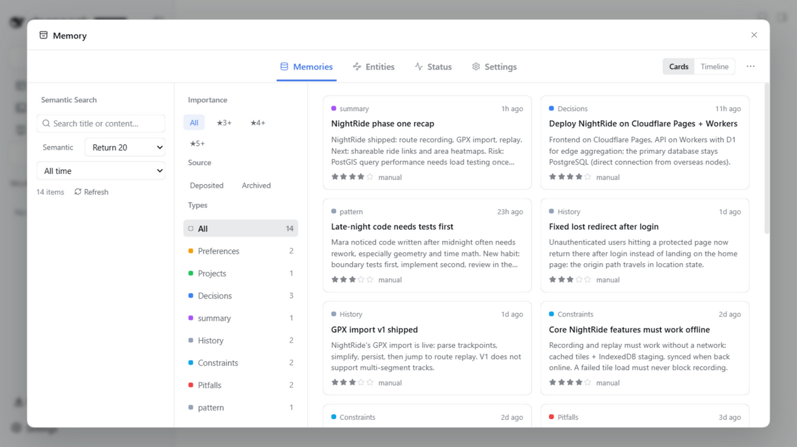
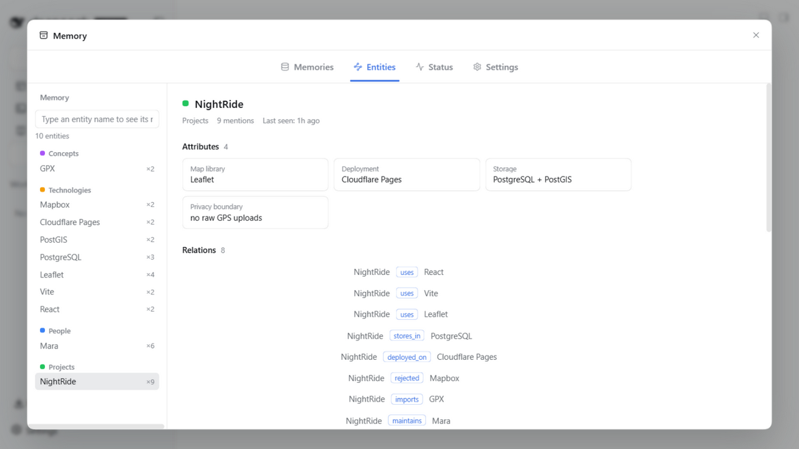
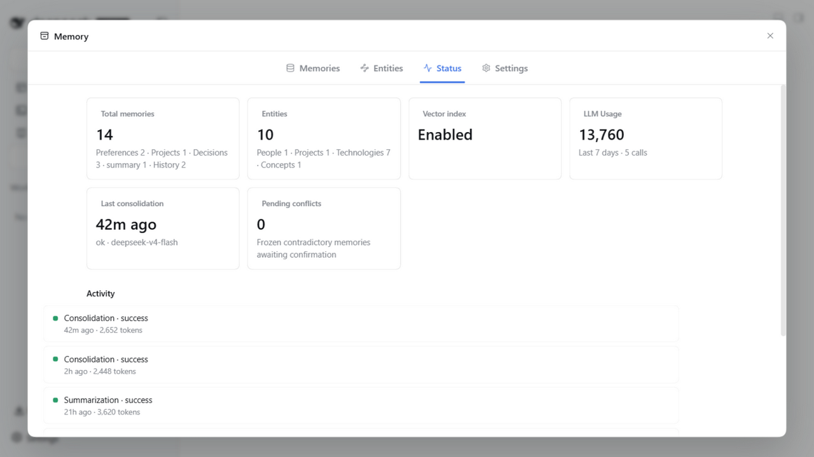
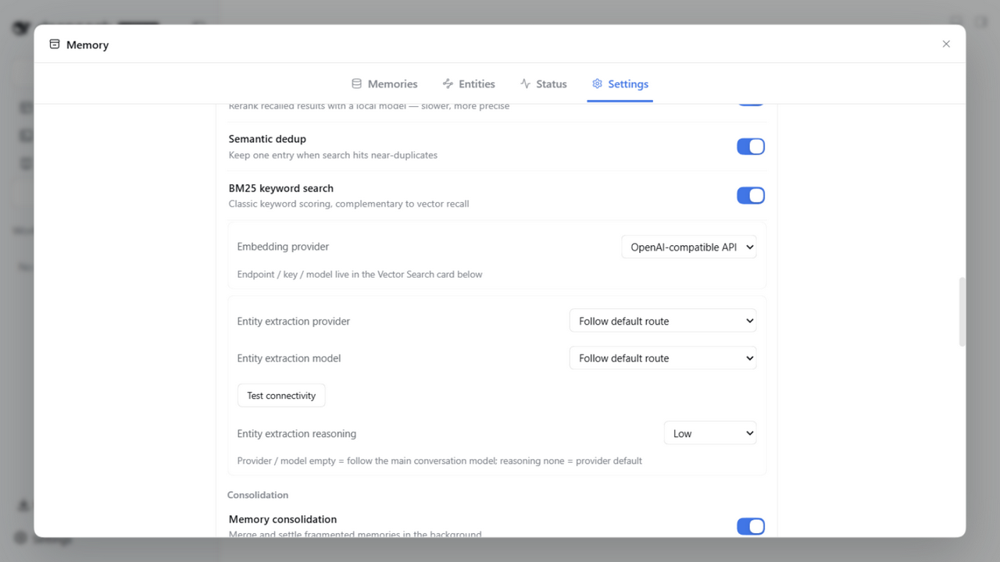
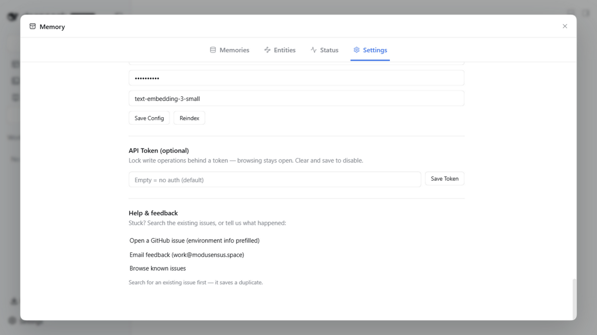

<p align="center">
  
</p>

<h1 align="center">dsh-mneme</h1>

<p align="center">
  <a href="https://www.npmjs.com/package/@modusensus/dsh-mneme"></a>
  <a href="https://www.npmjs.com/package/@modusensus/dsh-mneme"></a>
  <a href="LICENSE"></a>
  <a href="https://github.com/modusensus/dsh-mneme/actions"></a>
  <a href="https://nodejs.org"></a>
  <a href="https://github.com/modusensus/dsh-mneme"></a>
  <a href="https://codecov.io/gh/modusensus/dsh-mneme"></a>
  <a href="https://github.com/awesome-dsh-plugin/awesome-dsh-plugin"></a>
</p>

<p align="center">🌏 <a href="README.md">中文</a> · <a href="#english">English</a></p>

---

<a name="english"></a>

# 🧬 Give Your LLM a Memory That Evolves

**dsh-mneme** is a cross-session memory plugin for [DeepSeek Harness (DSH)](https://github.com/deepseek-ai/deepseek-harness). It does not just *store* your memories — it *manages* them: background deduplication and merging, conflicts frozen for your review, a fully replayable audit trail, offline by default, and export to human-readable Markdown.

> **Mneme** (Μνήμη) comes from **Mnemosyne**, the Greek goddess of memory and dreams — just as `autoDream` quietly consolidates your memory store in the background.

## What problem does it solve

Every time you start a new chat, the AI acts like it's never met you?

**dsh-mneme gives DeepSeek Harness cross-session memory.** Projects you've discussed, preferences you've mentioned, decisions you've made — the AI remembers them even after you close the window.

| Scenario | Without plugin | With plugin |
|----------|---------------|-------------|
| Continue a project discussion from Monday on Wednesday | "Can you describe your project again?" | "You mean the blog refactor from last week? You mentioned wanting to use Astro." |
| Tell the AI your coding habits | Repeat every session | Set once, remember forever |
| Close window after organizing research | Notes are lost | Auto-archived, retrievable anytime |

> But what makes dsh-mneme trustworthy lives in the background you never see. These are the traits that set it apart from "a plugin that just saves things."

## Why you can trust it

- 🧾 **Replayable, accountable** — every consolidation leaves a "decision receipt": input snapshot + decision detail + result hash. The same run reproduces the same outcome. **No silent mis-merges, no untraceable changes.**
- ⚖️ **Conflicts freeze, you decide** — when two memories contradict, it does not take sides for you. The suspected conflict is **parked for review** and only applied once you confirm. On hard judgments, a human stays in the loop.
- 🌙 **It works while you sleep** (opt-in) — idle time triggers tiered archiving: frequent memories stay hot, stale ones compress to summaries, old ones archive. The store **stays lean as it grows**.
- 🧠 **Local semantic search, offline by default** — built-in local Embedding + reranking. No API key required; retrieval still works without a network.
- 📝 **Two-way Markdown sync** — memories are local `.md` files you can open and edit; **human edits are respected**, never clobbered by the machine.
- 💾 **Delete the session ≠ delete the memory** — clearing a chat window keeps what was saved (configurable).

## 5-minute quickstart

```bash
# Install the plugin
dsh plugin --profile web add @modusensus/dsh-mneme
dsh web
```

It works out of the box. To feel its value in five minutes:

1. **Chat** — start a session and tell the AI something about your preferences or a project (e.g. "I prefer 4-space indentation.").
2. **Verify** — close the window, open a new one. If it recalls what you said, the memory has landed.
3. **Tune** — open **Settings → Memory Settings** and flip the three switches below as needed.

## Quick config (optional)

| Need | Config key | Default | Change |
|------|-----------|---------|--------|
| Fully offline | `embedProvider` | `openai` | Change to `local` |
| Keep memories when deleting sessions | `sessionLifecycleEnabled` | `false` | Change to `true` |
| Structured entity extraction | `entityExtractionEnabled` | `false` | Change to `true` |

> All of these live in DSH Settings → Memory Settings. Full config docs in the [Configuration section](dsh-mneme/README.en.md).

## The memory loop in one diagram

```
  write ──► quality filter (drop noise first)
    │
    ▼
  SQLite + local Markdown mirror
    │ (when idle)
    ├─ autoDream   : dedupe / merge / archive / fix / freeze-conflict
    └─ Sleep Mode  : tiered compression + pattern discovery + relation completion (opt-in)
    │
    ▼
  recall (hybrid search + rerank) ──► inject into the conversation
```

## Screenshots

> The panel is bilingual and follows your DSH interface language. Shown in English below.

<p align="center">
  <br/>
  <i>Record, browse and filter your memories.</i>
</p>

<p align="center">
  <br/>
  <i>Entities are extracted from your memories, building a relation graph with attributes.</i>
</p>

<p align="center">
  <br/>
  <i>The status panel shows your vector index, LLM spend and consolidation activity at a glance.</i>
</p>

<p align="center">
  <br/>
  <i>Retrieval, entity extraction and consolidation toggles are all configured in one place.</i>
</p>

<p align="center">
  <br/>
  <i>Optional write-protect token and feedback channels for a fully local, auditable setup.</i>
</p>

## Privacy

- Data stays on your machine only, never uploaded
- Memories are Markdown files, human-readable and editable
- Zero network dependency by default, no API key required
- No telemetry, no analytics, no remote logging

## Docs

| Doc | Path |
|-----|------|
| Full plugin docs (features / install / config / architecture) | [dsh-mneme/README.en.md](dsh-mneme/README.en.md) |
| Entity structure design | [dsh-mneme/docs/ENTITIES.md](dsh-mneme/docs/ENTITIES.md) |
| Semantic architecture | [dsh-mneme/docs/SEMANTIC.md](dsh-mneme/docs/SEMANTIC.md) |
| Local model guide | [dsh-mneme/docs/LOCAL_MODEL.md](dsh-mneme/docs/LOCAL_MODEL.md) |
| v0.1 migration | [dsh-mneme/docs/MIGRATION.md](dsh-mneme/docs/MIGRATION.md) |
| Changelog | [dsh-mneme/CHANGELOG.md](dsh-mneme/CHANGELOG.md) |
| Security | [SECURITY.md](SECURITY.md) |

## 🗺️ Roadmap

```
🧬 Gene → 🛡️ Audit hardening → 💤 Sleep maintenance → 🕸️ Recall fusion & graph → ✨ Panel enhancement → 🌡️ Self-evolving memory → 🕸️ Graph enhancement
```

| Version | Theme | Status |
|---------|-------|--------|
| **v0.3** | Gene: entities / time-boxed attributes / relations | ✅ |
| **v0.4** | Sleep Mode: idle 4-phase deep maintenance | ✅ |
| **v0.5** | Recall fusion & visualization: BM25 + graph + hot memory | ✅ |
| **v0.6** | Session lifecycle: delete session ≠ delete memory | ✅ |
| **v0.7** | Self-evolving memory: heat decay + sleep dual-protection + desktop workbench/feature toggles | ✅ |
| **v0.8** | Graph enhancement: interest-drift viz + scope isolation + cross-workspace sharing | 🚧 Planned (late Sep) |

> Full per-minor-version roadmap in [dsh-mneme/README.en.md](dsh-mneme/README.en.md#-evolution-roadmap).

## 🧪 Local development

```bash
cd dsh-mneme && npm install
npm test        # 744 tests
npm run stress  # three-axis stress test
npm run sync    # src → lib sync
```

## 📜 License

MIT