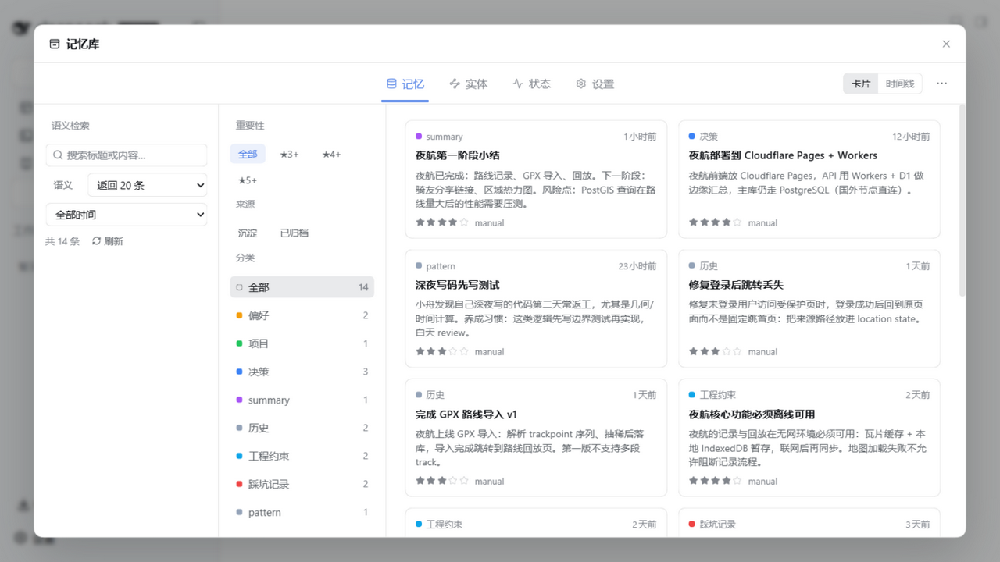
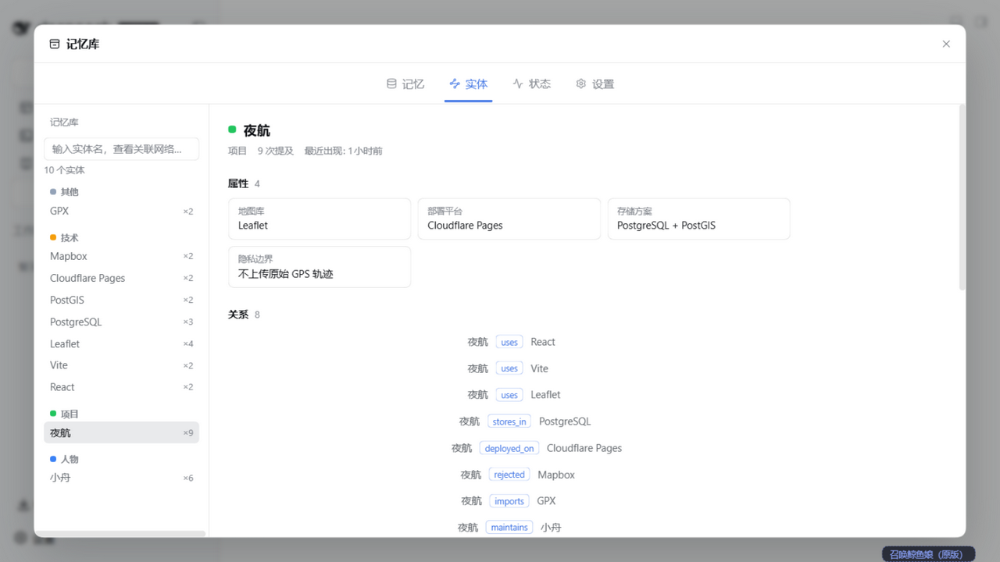
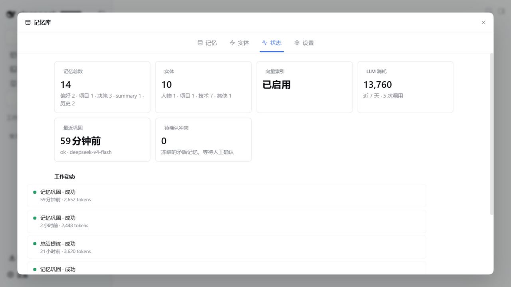
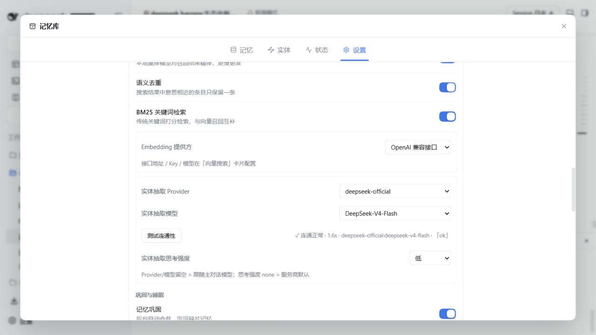
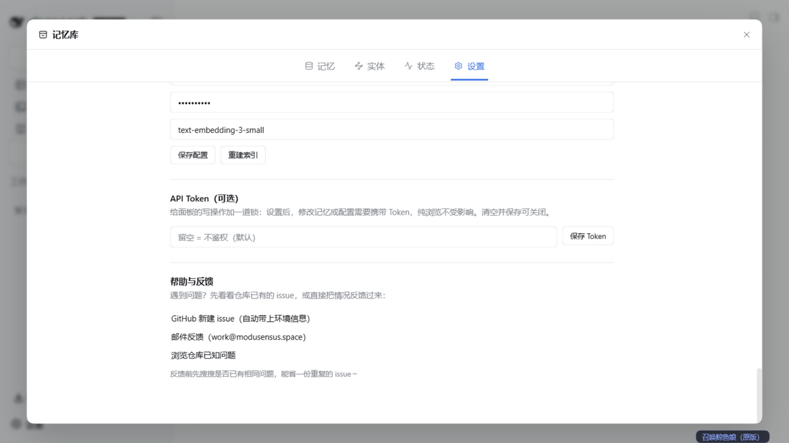

<p align="center">
  
</p>

<h1 align="center">dsh-mneme</h1>

<p align="center">
  <a href="https://www.npmjs.com/package/@modusensus/dsh-mneme"></a>
  <a href="https://www.npmjs.com/package/@modusensus/dsh-mneme"></a>
  <a href="LICENSE"></a>
  <a href="https://github.com/modusensus/dsh-mneme/actions"></a>
  <a href="https://nodejs.org"></a>
  <a href="https://github.com/modusensus/dsh-mneme"></a>
  <a href="https://codecov.io/gh/modusensus/dsh-mneme"></a>
  <a href="https://github.com/awesome-dsh-plugin/awesome-dsh-plugin"></a>
</p>

<p align="center">🌏 <a href="#中文">中文</a> · <a href="README.en.md">English</a></p>

---

<a name="中文"></a>

# 🧬 给 LLM 装上会自我进化的记忆

**dsh-mneme** 是 [DeepSeek Harness (DSH)](https://github.com/deepseek-ai/deepseek-harness) 的跨会话记忆插件。它不只「存得下」，更「管得好」：后台自动去重合并、矛盾先冻结等你裁决、全程可回放审计、默认全离线，还支持导出成人可读的 Markdown。

> **Mneme**（Μνήμη）源自希腊记忆女神 **Mnemosyne**。她掌管记忆与梦境——正如 `autoDream` 在后台默默巩固你的记忆库。

## 它解决什么问题

每次新开对话，AI 都像第一次认识你？

**dsh-mneme 给 DeepSeek Harness 装上跨会话记忆。** 你聊过的项目、提过的偏好、做过的决定，AI 都记得——即使关掉了窗口，下次打开还在。

| 场景 | 没装插件 | 装了插件 |
|------|---------|---------|
| 周一聊完项目需求，周三继续 | "能再描述一下你的项目吗？" | "你指的是上周提到的博客重构吗？当时你说想用 Astro。" |
| 告诉 AI 你的编码习惯 | 每轮都要重复交代 | 一次设定，长期生效 |
| 整理大量资料后关窗口 | 资料丢了 | 自动归档，随时检索找回 |

> 但 dsh-mneme 的可信之处，恰恰在你**看不见**的后台。下面这些，才是它和「一个会存东西的插件」的本质区别。

## 为什么可以信任它

- 🧾 **可回放、可追责** — 每次自动整理都留一张「决策凭证」：输入快照 + 决策明细 + 结果哈希，同样的整理可复现回放，**不默默吞错、不留无法追溯的改动**。
- ⚖️ **矛盾先冻结，等你裁决** — 两条记忆打架时，不擅自替你做主。可疑冲突会**挂起待审**，你确认后才生效。复杂判断，人永远在线。
- 🌙 **夜深人静才动手**（可关）— 空闲时自动分层归档：常看的留在热区、久不用的压成摘要、陈旧的彻底归档。记忆库**越用越精炼，不膨胀**。
- 🧠 **本地语义检索，默认离线** — 自带本地 Embedding 与精排，不强求 API Key，网络断了也能检索。
- 📝 **Markdown 双向同步** — 记忆就是本地 `.md` 文件，随时打开编辑；**人工改动会被优先尊重**，不会被机器覆盖。
- 💾 **删对话 ≠ 删记忆** — 清空聊天窗口，已保存的记忆仍在（可配置）。

## 5 分钟上手

```bash
# 安装插件
dsh plugin --profile web add @modusensus/dsh-mneme
dsh web
```

装完即可用。想在 5 分钟内看到它的价值：

1. **聊**：新开对话，跟 AI 聊几句关于你的偏好或手头项目（比如"我写代码更喜欢 4 空格缩进"）。
2. **等**：关掉窗口，重开新对话。如果它还记得刚才的事，说明记忆已经写入。
3. **调**：去「设置 → 记忆库设置」按需打开下面三个开关（见快速配置）。

## 快速配置（可选）

| 需求 | 配置项 | 默认值 | 改法 |
|------|--------|--------|------|
| 完全离线运行 | `embedProvider` | `openai` | 改为 `local` |
| 删除对话时保留记忆 | `sessionLifecycleEnabled` | `false` | 改为 `true` |
| 自动提取结构化实体 | `entityExtractionEnabled` | `false` | 改为 `true` |

> 以上均在 DSH 设置面板 → 记忆库设置 中修改。完整配置见 [配置章节](dsh-mneme/README.md)。

## 一图看懂记忆闭环

```
  写入 ──► 质量过滤（无用信息先拦下）
    │
    ▼
  SQLite + 本地 Markdown 镜像
    │（空闲时）
    ├─ autoDream ：去重 / 合并 / 归档 / 修正 / 冲突冻结
    └─ Sleep Mode ：分层压缩 + 模式发现 + 关系补全（可关）
    │
    ▼
  召回（混合检索 + 精排）──► 注入会话上下文
```

## 界面预览

> 面板内置中英双语，跟随你的 DSH 界面语言显示。下面为中文示例。

<p align="center">
  <br/>
  <i>记录、浏览与筛选你的记忆。</i>
</p>

<p align="center">
  <br/>
  <i>自动从记忆里提炼实体，构建带属性的关系图谱。</i>
</p>

<p align="center">
  <br/>
  <i>状态面板一眼看清向量索引、LLM 消耗与自动巩固记录。</i>
</p>

<p align="center">
  <br/>
  <i>检索、实体抽取与记忆巩固开关都在设置里一站式配置。</i>
</p>

<p align="center">
  <br/>
  <i>可选写保护 Token，以及本地化的反馈通道，让记忆库完全本地、可审计。</i>
</p>

## 隐私承诺

- 数据只存在你的电脑本地，不上传任何服务器
- 记忆是 Markdown 文件，人类可读、可手工编辑
- 默认零网络依赖，不需要 API Key
- 无遥测、无分析、无远程日志

## 文档

| 文档 | 路径 |
|------|------|
| 插件完整文档（功能 / 安装 / 配置 / 架构） | [dsh-mneme/README.md](dsh-mneme/README.md) |
| 实体结构化设计 | [dsh-mneme/docs/ENTITIES.md](dsh-mneme/docs/ENTITIES.md) |
| 语义架构 | [dsh-mneme/docs/SEMANTIC.md](dsh-mneme/docs/SEMANTIC.md) |
| 本地模型部署指南 | [dsh-mneme/docs/LOCAL_MODEL.md](dsh-mneme/docs/LOCAL_MODEL.md) |
| v0.1 迁移说明 | [dsh-mneme/docs/MIGRATION.md](dsh-mneme/docs/MIGRATION.md) |
| 版本历史 | [dsh-mneme/CHANGELOG.md](dsh-mneme/CHANGELOG.md) |
| 安全策略 | [SECURITY.md](SECURITY.md) |

## 🗺️ 路线图

```
🧬 记忆基因 → 🛡️ 审计加固 → 💤 睡眠维护 → 🕸️ 召回融合与图谱 → ✨ 面板增强 → 🌡️ 自进化记忆 → 🕸️ 图谱增强
```

| 版本 | 主题 | 状态 |
|------|------|------|
| **v0.3** | 记忆基因：实体 / 属性（带时间轴）/ 关系 | ✅ |
| **v0.4** | Sleep Mode：空闲四阶段深度维护 | ✅ |
| **v0.5** | 召回融合与记忆可视化：BM25 + 图谱 + 热记忆 | ✅ |
| **v0.6** | 会话生命周期：删对话 ≠ 删记忆 | ✅ |
| **v0.7** | 自进化记忆：热度衰减 + 睡眠双保护 + 桌面端工作台/功能开关 | ✅ |
| **v0.8** | 图谱增强：兴趣漂移可视化 + 范围隔离 + 跨工作区共享 | 🚧 计划中（9 月末） |

> 完整逐小版本路线图见 [dsh-mneme/README.md](dsh-mneme/README.md#-进化路线图)。

## 🧪 本地开发

```bash
cd dsh-mneme && npm install
npm test        # 744 个测试
npm run stress  # 三轴线压测
npm run sync    # src → lib 同步
```

## 📜 License

MIT