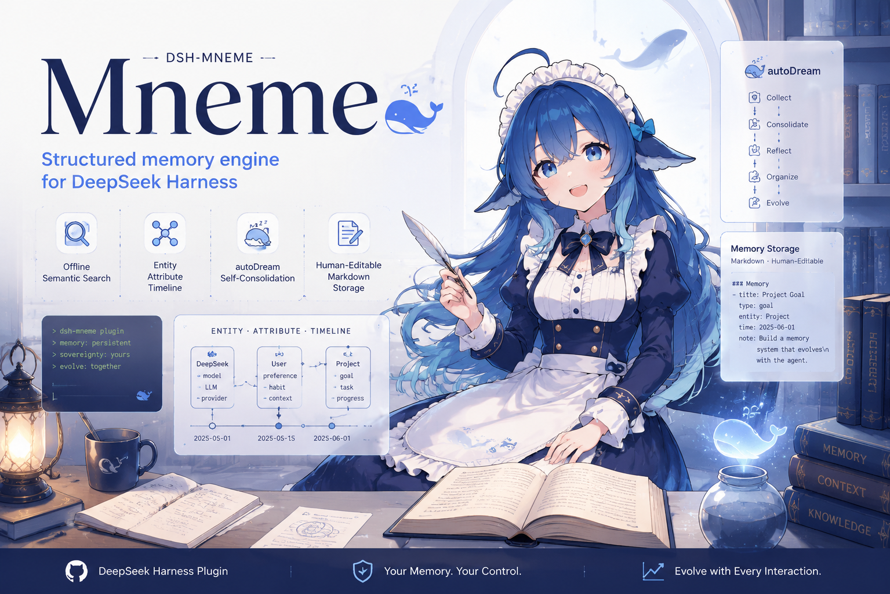

<p align="center"><strong><a href="README.md">中文</a> | <a href="README_EN.md">English</a></strong></p>

<p align="center">
  
</p>

<h1 align="center">dsh-mneme</h1>

<p align="center">
  <a href="https://www.npmjs.com/package/@modusensus/dsh-mneme"></a>
  <a href="LICENSE"></a>
  <a href="https://github.com/awesome-dsh-plugin/awesome-dsh-plugin"></a>
  <a href="https://github.com/modusensus/dsh-mneme/actions"></a>
  <a href="https://nodejs.org"></a>
  <a href="https://github.com/modusensus/dsh-mneme"></a>
</p>

> **Memory sovereignty, returned to you** — memory is no longer a black box, but Markdown you can read and edit.

`dsh-mneme` is a [DeepSeek Harness (DSH)](https://github.com/deepseek-ai/deepseek-harness) plugin that gives agents persistent cross-session memory. **Mneme** (Μνήμη) — named after Mnemosyne, the Greek goddess of memory who governs memory and dreams, just as autoDream consolidates memories in the background.

Unlike plugins that lock memory inside a database, Mneme writes memory as **Markdown you can read** — memory sovereignty stays with you: you can see it, edit it, delete it. Memory shouldn't be decided by the agent alone.

## ✨ Features

- **🧠 Memory sovereignty**: SQLite + **human-editable Markdown mirror**, two-way sync — memory is transparent, auditable, and yours
- **autoDream consolidation**: background dedup / merge / archive / conflict resolution (fail-safe validation), refined with use
- **6 model tools**: `memory_save` / `memory_search` / `memory_list` / `memory_update` / `memory_delete` / `memory_forget`
- **Auto-injection + session summary**: relevant memories injected at session start, preferences / decisions / lessons distilled at session end
- **Web memory panel**: embedded in the official settings panel — browse by type, full-text + semantic (vector) search
- **User settings**: user profile + behavior rules, injected into system prompt every turn
- **Custom commands**: register slash commands (/name), routed to the agent when triggered
- **Vector search**: OpenAI-compatible embeddings API for semantic matching of differently-worded but related memories

## 📦 Install (DSH)

```bash
dsh plugin --profile web add @modusensus/dsh-mneme
dsh web
```

> Requires Node 24+ (`node:sqlite`). See [full plugin docs](dsh-mneme/README.md) for install / config / architecture.

## 📁 Repository Structure

```
dsh-mneme/   plugin package (npm @modusensus/dsh-mneme)
docs/        design docs & implementation plans
```

## 🧪 Local Development

```bash
cd dsh-mneme
npm install
npm test          # 140 tests
npm run sync      # src → lib sync (runs automatically on publish)
```

## 📄 Docs

| Doc | Path |
|-----|------|
| Full plugin docs (features / install / config / architecture) | [dsh-mneme/README.md](dsh-mneme/README.md) |
| Plugin design | [docs/superpowers/specs/2026-08-13-dsh-mneme-design.md](docs/superpowers/specs/2026-08-13-dsh-mneme-design.md) |
| autoDream design | [docs/superpowers/specs/2026-08-13-dsh-mneme-autodream-design.md](docs/superpowers/specs/2026-08-13-dsh-mneme-autodream-design.md) |
| Implementation plan (core) | [docs/superpowers/plans/2026-08-13-dsh-memory.md](docs/superpowers/plans/2026-08-13-dsh-memory.md) |
| Implementation plan (autoDream) | [docs/superpowers/plans/2026-08-13-dsh-memory-autodream.md](docs/superpowers/plans/2026-08-13-dsh-memory-autodream.md) |

## 📜 License

MIT
