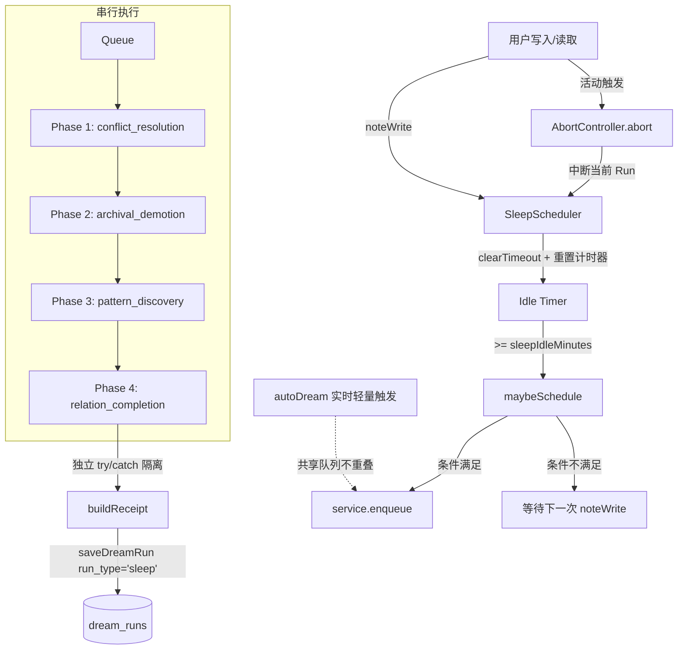

# dsh-mneme Sleep Mode 系统级睡眠设计文档

## 概述
从被动整理到主动维护：在系统空闲时段自动执行深度记忆压缩、冲突消解、模式发现与关系补全，实现知识库的长效健康治理。

## 动机与设计原则
- **非侵入性**：仅在用户空闲（Idle）时触发，不干扰正常读写与实时推理。
- **可中断**：用户一旦产生活动，立即中止当前睡眠周期，保障实时体验。
- **分层压缩**：按访问热度与时间衰减进行阶梯式降级，保留核心语义，释放存储压力。
- **模式发现**：利用 LLM 挖掘长期记忆中的隐性规律，生成结构化 Pattern 实体。
- **审计延续**：与 `autoDream` 共享 `dream_runs` 审计表，通过 `run_type` 区分，保障全链路可追溯。

## 架构图

## 配置项说明
| 配置项 | 默认值 | 说明 |
|:---|:---|:---|
| `sleepModeEnabled` | `false` | 全局开关（Opt-in），开启后激活调度器 |
| `sleepIdleMinutes` | `5` | 连续无操作触发睡眠的阈值（分钟） |
| `sleepMinIntervalHours` | `8` | 两次 Sleep Run 的最小时间间隔（小时） |
| `sleepConflictStrictness` | `'normal'` | 冲突消解严格度：`'gentle'`(0.92) / `'normal'`(0.85) / `'aggressive'`(0.75) |
| `sleepArchiveDays` | `30` | 进入冷存储/摘要降级的天数阈值 |
| `sleepCompressDays` | `90` | 进入完全归档（Archive）的天数阈值 |
| `sleepPatternMinMemories` | `100` | 模式发现阶段扫描的最近记忆条数下限 |
| `sleepPatternLookbackDays` | `30` | 模式发现回溯的时间窗口（天） |
| `sleepMaxPatternPerRun` | `3` | 单次运行最多创建的模式数量上限 |
| `sleepProvider` | `''` | 睡眠模式专用 LLM Provider（留空则复用默认） |
| `sleepModel` | `''` | 睡眠模式专用 LLM Model（留空则复用默认） |
| `sleepReasoningEffort` | `'none'` | 睡眠 LLM 推理强度透传：`low` / `medium` / `high` / `none`。`none`（默认）= 不传该字段，使用模型默认；思考型模型预算被推理耗尽时可设 `low`（与 `dreamReasoningEffort` 语义一致） |

## 四阶段详解
每个阶段独立包裹 `try/catch`，任一阶段失败仅跳过该阶段，不阻塞后续流程。

### 1. `conflict_resolution`（冲突消解）
- **目标**：清理向量空间中的重复、矛盾或过时记忆。
- **输入**：全量/增量记忆向量索引、`sleepConflictStrictness` 阈值。
- **算法**：
  1. 向量检索 `findPotentialConflicts` 获取高相似度对。
  2. LLM 仲裁：基于严格度阈值生成 `keep/merge/discard` 决策。
  3. `validateDecisions`：严格校验决策合法性，缺省策略为 `keep`。
  4. `applyDecisions`：批量执行状态变更。
- **输出**：冲突消解报告（决策明细）。
- **验收**：无合法记忆被误删；仲裁结果符合配置的严格度阈值；决策可回滚。

### 2. `archival_demotion`（归档降级）
- **目标**：按时间衰减对记忆进行分层压缩，释放热存储压力。
- **输入**：`last_accessed_at` 排序的记忆列表、`sleepArchiveDays`、`sleepCompressDays`。
- **算法**（纯规则、无 LLM，确定性执行）：
  - `>= sleepCompressDays`：调用 `setArchived` 完全归档。
  - `>= sleepArchiveDays && < sleepCompressDays`：调用 `demoteToSummary(m.id, 摘要, {minRefTimeMs: archiveCut})` 转为摘要态——原内容存入 `_full_content`，摘要由前 120 字截断生成（LLM 未配置时的 fallback）。
  - `< sleepArchiveDays`：保持原状不动。
  - **minRefTimeMs 关键点**：传入快照时刻 `archiveCut`，`demoteToSummary` 在事务内复查 `last_accessed_at`——快照后被召回 touch 的记忆视为"重新活跃"，跳过不降级。
- **输出**：降级操作清单与状态快照。
- **验收**：严格遵循分层阈值；`minRefTimeMs` 机制生效，防止快照后 `touch` 导致的误降级；摘要保留 `_full_content` 可无损恢复。

### 3. `pattern_discovery`（模式发现）
- **目标**：从近期记忆中提炼可复用的隐性规律或知识模式。
- **输入**：最近 `sleepPatternLookbackDays` 内的 `sleepPatternMinMemories` 条记忆。
- **算法**：
  1. LLM 扫描分析，提取候选模式。
  2. **证据校验**：强制 `evidence` 列表与数据库真实 ID 求交集（`intersect`），过滤伪造/幻觉引用。
  3. 输出 `type=pattern` 创建指令，受 `sleepMaxPatternPerRun` 限制。
- **输出**：新创建的 Pattern 实体及关联证据链。
- **验收**：无孤立证据；Pattern 创建数不超上限；证据 100% 可溯源。

### 4. `relation_completion`（关系补全）
- **目标**：修复知识图谱中的断链与孤立节点。
- **输入**：`listEntities` 获取的实体列表、关系图谱。
- **算法**：
  1. 筛选 `getRelations` 返回为空的孤立实体。
  2. 基于上下文推断关系：
     - 语义/实体共现 → `related_to`
     - 同属项目/模块 → `part_of`
     - 技术栈/流程依赖 → `depends_on`
  3. 批量写入关系边。
- **输出**：新增关系边列表。
- **验收**：关系推断符合领域常识；不引入循环依赖；图谱连通性提升。

## 分层压缩策略表
| 记忆层级 | 判定条件 (`last_accessed_at`) | 处理策略 | 存储形态 |
|:---|:---|:---|:---|
| **活跃 (Active)** | `< sleepArchiveDays` | 保持原状，正常搜索可见 | 全文索引 + 向量 |
| **冷 (Cold)** | `>= sleepArchiveDays` 且 `< sleepCompressDays` | `demoteToSummary` 压成摘要，原文进 `_full_content` | 摘要 + `_full_content` 分离 |
| **睡眠 (Archived)** | `>= sleepCompressDays` | `setArchived` 移出热查询域 | 仅保留元数据与归档标记 |

## 调度器与可中断机制
- **`noteWrite()` 心跳重置**：每次用户写入/读取记忆时触发。必须先 `clearTimeout` 清除旧计时器，再重新设置 Idle Timer，彻底杜绝 Stale Timer 导致的误触发。
- **`maybeSchedule()` 准入控制**：串行检查 `sleepModeEnabled` → 空闲时长 `>= sleepIdleMinutes` → 距上次运行 `>= sleepMinIntervalHours` → 状态非 `running/disposed`。任一不满足则放弃调度。
- **`service.enqueue` 串行队列**：所有 Sleep Run 必须进入全局串行队列执行，与 `autoDream` 严格互斥，避免并发写入冲突与资源争抢。
- **`AbortController` 可中断**：调度器持有 AbortController 实例。一旦检测到用户活动（`noteWrite` 或显式交互），立即调用 `abort()` 中断当前 `runSleep` 的执行上下文，保证实时性优先。

## 数据迁移与存储层变更
- **幂等迁移**：
  - `memories` 表新增列：`last_accessed_at` (DATETIME)、`_full_content` (TEXT/BLOB)。
  - `dream_runs` 表新增列：`run_type` (VARCHAR, 默认 'auto'，用于区分 'sleep')。
  - 迁移脚本需保证幂等（`IF NOT EXISTS` / 检查列是否存在）。
- **Store 新增方法**：
  - `demoteToSummary(id, summary, opts)`：执行降级并记录 `minRefTimeMs`。
  - `restoreContent(id)`：按需从归档/摘要恢复原文。
  - `touchLastAccess(id)`：更新 `last_accessed_at` 至当前时间。
  - `getUnrecalledSince(days)`：按时间窗口拉取未召回记忆。
  - `listEntities()`：获取实体列表用于关系分析。
- **Service 扩展**：
  - `enqueue(task)`：串行任务队列入口。
  - `setSleepHook(fn)`：注入 `noteWrite` 钩子。
  - `touchRecalled(id)`：在召回路径中自动更新访问时间。

## 与 autoDream 的协作关系
| 维度 | autoDream (实时) | Sleep Mode (系统级) |
|:---|:---|:---|
| **触发时机** | 写入阈值/实时事件 | 系统空闲 + 定时周期 |
| **执行深度** | 轻量级、局部关联补全 | 深度扫描、全局压缩与模式提炼 |
| **资源占用** | 低延迟、短时 | 允许较高延迟、长时运行 |
| **队列关系** | 共享 `service.enqueue` 串行队列 | 共享 `service.enqueue` 串行队列（严格互斥不重叠） |
| **审计记录** | 共用 `dream_runs`，`run_type='auto'` | 共用 `dream_runs`，`run_type='sleep'` |

## 实现要点与避坑（v0.4.1 教训）
1. **Stale Timer 防护**：`noteWrite()` 中必须严格遵循 `clearTimeout(oldTimer) -> setNewTimer()` 顺序，否则快速连续写入会累积多个 Timer 导致频繁误触发。
2. **`minRefTimeMs` 防误降级**：调用 `demoteToSummary` 时必须传入快照时刻 `{minRefTimeMs: archiveCut}`。否则在 Sleep Run 执行期间被用户 `touch` 的记忆会因时间窗口漂移被错误降级。
3. **证据强过滤**：Pattern Discovery 阶段 LLM 返回的 `evidence` 必须与 DB 真实 ID 列表求交集。未通过 `intersect` 校验的证据一律丢弃，严防幻觉伪造关联。
4. **严格串行化**：所有 Sleep Run **必须**走 `service.enqueue`。禁止直接调用异步函数启动，确保与 `autoDream` 绝对不重叠，避免写入锁冲突。
5. **Fail-Safe 阶段隔离**：四阶段必须各自独立 `try/catch`。LLM 服务抖动或网络异常时，仅跳过当前阶段（如跳过 Pattern 发现），后续阶段（如 Demotion、Relation）必须继续执行并记录 Receipt。
6. **无 LLM 降级路由**：当 `resolveSleepRoute` 返回 `undefined`（如 Provider 未配置或模型不可用）时，系统应自动跳过所有依赖 LLM 的阶段，但 `archival_demotion`（纯规则）仍需照常执行，保障基础压缩能力不丢失。

## 测试清单
- [ ] **调度器**：验证 `sleepIdleMinutes` 触发准确性；验证 `clearTimeout` 防 Stale；验证 `sleepMinIntervalHours` 冷却生效。
- [ ] **中断机制**：运行中触发 `noteWrite`，验证 `abort()` 立即终止 Run 且状态回滚至安全点。
- [ ] **阶段隔离**：Mock LLM 500 错误，验证仅对应阶段跳过，Receipt 仍生成且 `run_type='sleep'`。
- [ ] **降级策略**：构造不同 `last_accessed_at` 的记忆，验证 `minRefTimeMs` 防误降级逻辑及分层归档正确性。
- [ ] **模式发现**：注入含虚假 ID 的 LLM 响应，验证 `intersect` 过滤生效且创建数 `<= sleepMaxPatternPerRun`。
- [ ] **迁移幂等**：重复执行迁移脚本，验证无报错、无重复列/数据。
- [ ] **队列互斥**：并发触发 `autoDream` 与 Sleep，验证 `service.enqueue` 串行执行无重叠。

## 启用指南（Opt-in）
1. **配置开启**：在 `config.js` 或环境变量中设置 `sleepModeEnabled: true`。
2. **资源评估**：建议生产环境配置独立的 `sleepProvider` 与 `sleepModel`，避免与实时推理争抢额度/并发。
3. **初始运行**：首次启用后，系统将在首次空闲 `>= sleepIdleMinutes` 时触发全量扫描。可通过查看 `dream_runs` 表中 `run_type='sleep'` 的记录监控执行结果。
4. **调优建议**：初期可设置 `sleepConflictStrictness: 'gentle'`，观察 `conflict_resolution` 决策准确率后再逐步收紧至 `'normal'` 或 `'aggressive'`。
5. **关闭恢复**：设置 `sleepModeEnabled: false` 后，调度器将在 `dispose()` 阶段清理 Timer 并释放 Hook，已归档数据可通过 `restoreContent` 按需恢复。